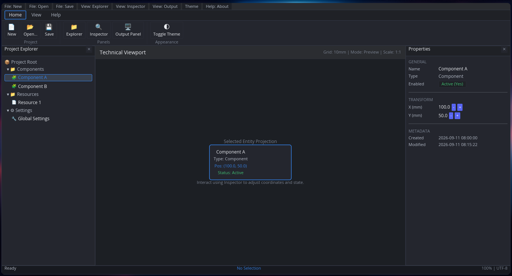

# iced-desktop-shell

> An experimental technical desktop application shell boilerplate built with Rust and [Iced](https://iced.rs).

`iced-desktop-shell` is an experimental starter boilerplate designed for building technical, engineering, industrial, and productivity desktop applications in Rust. It explores a classic desktop shell layout using a top menu bar, data-driven ribbon, collapsible panels, properties inspector, diagnostics output, status bar, and centralized commands.



---

## Architectural Principles & Scope

- **Clean Elm Architecture**: State / Message / Update / View pattern with clear separation between reusable shell framing (`src/shell/`) and domain logic (`src/demo/`).
- **Data-Driven Ribbon**: Tabs, groups, and items driven by data structures referencing command IDs.
- **Centralized Command System**: Widgets emit `CommandId` dispatched centrally; command execution can return asynchronous tasks (such as `iced::exit()`).
- **Generic Panel Registry**: Panels are registered dynamically via `PanelId`, `PanelLocation` (Left, Right, Bottom), and configurable sizes (`PanelState.size`). `DockLayout.order` is the single source of truth for panel arrangement.
- **Shortcuts with Event Status**: Listens using `event::listen_with` to ensure global keyboard shortcuts do not intercept keystrokes in active input widgets.
- **Design Tokens & Theming**: Design tokens (`tokens.rs`) and color palettes (`DARK_PALETTE`, `LIGHT_PALETTE`) with Dark Mode as default.
- **Pure Defaults & Persistence**: `ShellState::default()` is pure (no disk I/O); persistent preferences are loaded explicitly by `AppState::new()` and deserialize safely with `#[serde(default)]`.
- **Licensing**: Dual MIT / Apache-2.0.

> **Note on Docking**: This initial v0.1 version implements a multi-panel layout manager governing panel visibility, positions, sizes, and layout order. It is structured so that full `PaneGrid`-based docking (splits, dragging, and tabbed reorganization) can be introduced in subsequent work without changing the core application API.

---

## Intended Target Domains

- Industrial configuration and diagnostics utilities
- CNC and motion control interfaces
- Hardware test and telemetry dashboards
- CAD/CAM and technical geometry viewers
- Embedded devtools and network analyzers

---

## Project Structure

```
iced-desktop-shell/
├── Cargo.toml                  # Simplified dependencies (iced = "0.14")
├── Cargo.lock                  # Lockfile
├── .gitignore                  # Git ignore rules
├── rust-toolchain.toml         # Rust toolchain pinning (stable)
├── README.md                   # Project overview
├── AGENTS.md                   # AI agent constraints and guidelines
├── LICENSE-MIT                 # MIT license
├── LICENSE-APACHE              # Apache 2.0 license
├── .github/workflows/ci.yml    # CI workflow
├── docs/ARCHITECTURE.md        # Technical architecture document
├── assets/                     # Static assets (README screenshot)
├── tests/shell_tests.rs        # Test suite
└── src/
    ├── lib.rs                  # Library root exposing app, shell, and demo
    ├── main.rs                 # Tracing subscriber & application runner
    ├── app/                    # Application coordination (State, Message, Update, View)
    ├── shell/                  # Reusable GUI shell infrastructure (Zero domain knowledge)
    │   ├── command/            # Command, CommandId, CommandRegistry, Shortcut
    │   ├── ribbon/             # Data-driven Ribbon model and view
    │   ├── dock/               # Generic DockLayout managing registered panels
    │   ├── panel/              # Generic PanelId, PanelLocation, PanelState
    │   ├── workspace/          # Central workspace canvas container
    │   ├── inspector/          # Generic inspector container
    │   ├── bottom_panel/       # Output & diagnostics panel with tabs
    │   ├── status_bar/         # Status bar (Left, Center, Right)
    │   ├── menu/               # Top menu bar connected to CommandId
    │   ├── theme/              # Design tokens (tokens.rs) and palettes (style.rs)
    │   └── persistence/        # Shell preferences persistence (JSON)
    └── demo/                   # Technical demo (Application-level domain)
        ├── commands.rs         # Demo command registration (app.new, app.open, app.quit, etc.)
        ├── explorer.rs         # Project explorer tree panel
        ├── workspace.rs        # Technical preview viewport
        ├── inspector.rs        # Properties editor
        └── state.rs            # Demo state, entities, and diagnostics log
```

---

## Getting Started

### Prerequisites

- Rust stable via [rustup](https://rustup.rs/) (the exact toolchain is pinned in `rust-toolchain.toml`).
- A graphical session (X11 or Wayland) to run the application window.

### Running the Application

```bash
cargo run
```

For smoother rendering use `cargo run --release` (slower first build). The first build takes a while because it compiles the Iced GUI stack; subsequent builds are incremental.

### Quick Tour of the Demo

1. Select **Component A** in the Project Explorer (left panel).
2. Adjust its **X / Y** coordinates and enabled state in the Properties inspector (right panel).
3. Toggle the theme with **Appearance → Toggle Theme** in the ribbon, or clear the log from the Output panel (bottom).

### Running Checks and Tests

```bash
cargo fmt --check
cargo clippy --all-targets --all-features -- -D warnings
cargo test
cargo check
```

---

## License

Dual-licensed under either:

- **MIT License** ([LICENSE-MIT](LICENSE-MIT))
- **Apache License, Version 2.0** ([LICENSE-APACHE](LICENSE-APACHE))
